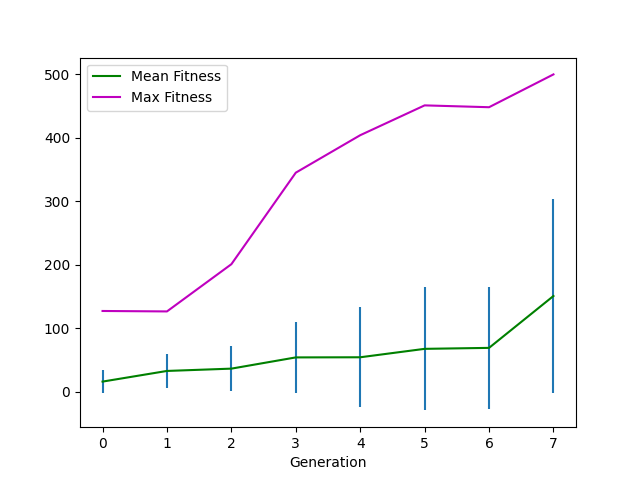
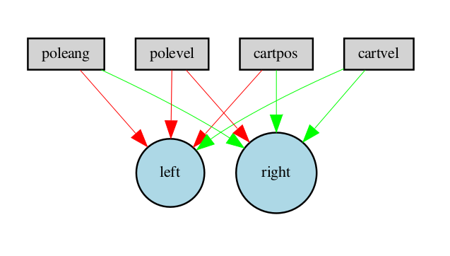

<p float="left">



</p>

## About

This repository contains code allowing you to train, test, and visualize
[OpenAI Gym](https://gym.openai.com/) environments (games) using the
[NEAT](https://www.cse.unr.edu/~sushil/class/gas/papers/NEAT.pdf) algorithm
and its variants.

The two goals of this project are 

1. Make this work as simple as possible, via config files.

2. Make the code run fast, by simultaneously evaluating the fitnesses of the
population on multiprocessor machines.

## Quickstart

To get started you should install [neat-python](https://github.com/CodeReclaimers/neat-python) 
and [PUREPLES](https://github.com/ukuleleplayer/pureples) from source. Then 
do the following:

```
% python3 neat-evolve.py config/cartpole
```
This will run neat-python on the [CartPole-v1](https://gym.openai.com/envs/CartPole-v1/) environment using the
[parallel fitness evaluator](https://neat-python.readthedocs.io/en/latest/module_summaries.html#parallel),
so you can take advantage of all the cores on your computer.

Once evolution finishes, you can try out your evolved network by doing:

```
% python3 neat-test.py models/CartPole-v1<fitness>.dat
```

where ```<fitness>``` is the fitness of your evolved network.
The ```visuals``` folder will contain a PDF showing the corresponding model,
and the ```runs``` folder will contain a CSV file with the history of the 
fitnesses (mean, standard deviation, max).  To visualize this history you
can run the ```neat-plot.py``` script on this CSV file.

## HyperNEAT and ES-HyperNEAT

NEAT-Gym supports [HyperNEAT](https://en.wikipedia.org/wiki/HyperNEAT) via the ```--hyper``` option and
and [ES-HyperNEAT](http://eplex.cs.ucf.edu/ESHyperNEAT/) via the <br> ```--eshyper``` option.

There are two ways to specify the substrate:

1. In the ```[Substrate]``` section of the config file (default)

2. Via a ```get_substrate()``` method in your environment.  This method should return a tuple containing the
input, hidden, and output coordinates and the name of the activation function (e.g., ```sigmoid```).  For
ES-HyperNEAT, the hidden coordinates should be ```None```.


## Novelty Search

NEAT-Gym supports
[Novelty Search](https://www.cs.swarthmore.edu/~meeden/DevelopmentalRobotics/lehman_ecj11.pdf)
via the ```--novelty``` option.  To use this option, the ```info``` dictionary 
returned by your environment's ```step()``` method should have an entry for ```behavior```,
whose value is the behavior of the agent at the end of the episode (for
example, its final position in the maze), or ```None``` before the end of the
episode.  For an example, try out the
[maze](https://github.com/simondlevy/neat-gym/tree/master/environments/maze)
environment.

## Using NEAT-Gym in other projects

The
[neat_gym](https://github.com/simondlevy/NEAT-Gym/blob/master/neat_gym/__init__.py)
module exports two functions:

* [read_file](https://github.com/simondlevy/neat-gym/blob/master/neat_gym/__init__.py#L85-L106) loads a .dat file 
from command-line arguments, returning the evolved network and the name of the envrionment used to evovle it
(as well as flags for recording a move and suppressing the display).

* [eval_net](https://github.com/simondlevy/neat-gym/blob/master/neat_gym/__init__.py#L109-L131)
takes the output of ```read-file``` and runs an episode of the environment using the network.

To make these functions available other projects (e.g., for
[3D animation](https://github.com/simondlevy/gym-copter/blob/master/neat/3dtest.py)
of your environment during testing), do:

```
% sudo python3 setup.py install
```

You will also need to create a NEAT configuration file for your environment.  As usual,
the easiest way to do this is to take something that works (like the 
[config file](https://github.com/simondlevy/neat-gym/blob/master/config/CartPole-v1.cfg)
for CartPole-v1) and modify it to do what you want.

## Related projects

* [neat-openai-gym](https://github.com/sroj/neat-openai-gym)

* [OpenAI-NEAT](https://github.com/HackerShackOfficial/OpenAI-NEAT)

* [AC-Gym](https://github.com/simondlevy/AC-Gym)

* [CMA-Gym](https://github.com/simondlevy/CMA-Gym)
